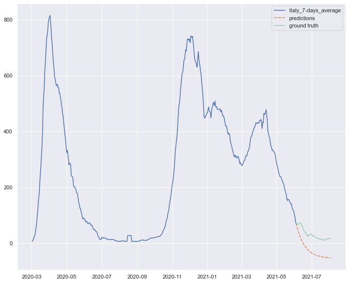
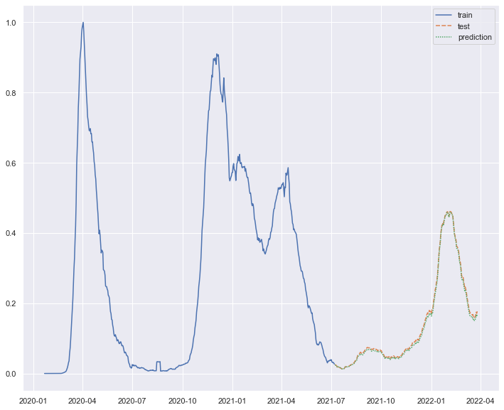
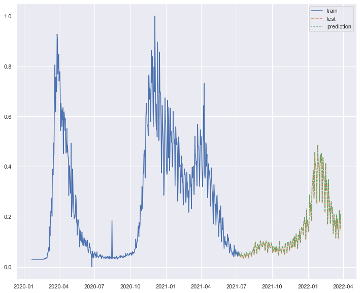
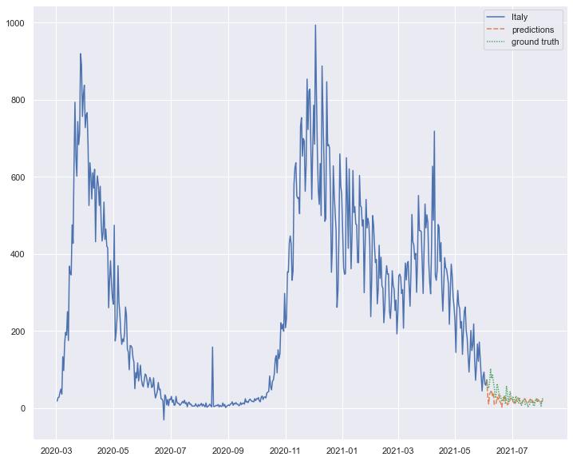

# IA Project Report

> Author : Jordan Beziaud

*Given data in a country, predict for one day the number of dead / covid cases*

## Project Organization


    ├── LICENSE
    ├── Makefile           <- Makefile with commands like `make data` or `make train`
    ├── README.md          <- The top-level README for developers using this project.
    ├── data
    │   ├── external       <- Data from third party sources.
    │   ├── interim        <- Intermediate data that has been transformed.
    │   ├── processed      <- The final, canonical data sets for modeling.
    │   └── raw            <- The original, immutable data dump.
    │
    ├── docs               <- A default Sphinx project; see sphinx-doc.org for details
    │
    ├── models             <- Trained and serialized models, model predictions, or model summaries
    │
    ├── notebooks          <- Jupyter notebooks. Naming convention is a number (for ordering),
    │                         the creator's initials, and a short `-` delimited description, e.g.
    │                         `1.0-jqp-initial-data-exploration`.
    │
    ├── references         <- Data dictionaries, manuals, and all other explanatory materials.
    │
    ├── reports            <- Generated analysis as HTML, PDF, LaTeX, etc.
    │   └── figures        <- Generated graphics and figures to be used in reporting
    │
    ├── requirements.txt   <- The requirements file for reproducing the analysis environment, e.g.
    │                         generated with `pip freeze > requirements.txt`
    │
    ├── setup.py           <- makes project pip installable (pip install -e .) so src can be imported
    ├── src                <- Source code for use in this project.
    │   ├── __init__.py    <- Makes src a Python module
    │   │
    │   ├── data           <- Scripts to download or generate data
    │   │   └── make_dataset.py
    │   │
    │   ├── features       <- Scripts to turn raw data into features for modeling
    │   │   └── build_features.py
    │   │
    │   ├── models         <- Scripts to train models and then use trained models to make
    │   │   │                 predictions
    │   │   ├── predict_model.py
    │   │   └── train_model.py
    │   │
    │   └── visualization  <- Scripts to create exploratory and results oriented visualizations
    │       └── visualize.py
    │
    └── tox.ini            <- tox file with settings for running tox; see tox.readthedocs.io

## Installation

This project uses python3.8, but any version > 3.6 will work.
To install all the dependencies, run the following command at the root of the project :

    python3 setup.py

In case it doesn't work, run `python3 -m pip install -r requirements.txt` instead.

## Usage & workflow

There is **2 main tools** to use in order to fully explore this project :
- 2 web applications created with `streamlit` that are meant for demonstrations purposes, such as using models to make predictions, or explore datasets
    To run them, **open 2 different shell instances and run** :
    ```bash
    # shell 1
    cd src/models
    streamlit run predict_model_app.py

    # shell 2
    cd visualization
    streamlit run exploration_app.py
    ```
    and discover them ! They are kept simple, with a limit set of features.
    **Warning : the prediction web app only work with ARIMA model for now. Look at the notebook number 4 for LSTM predictions**
- 2 scripts in `/src/models` to train and automatically save models in the `{ROOT_FOLDER]/models` directory (**warning : there is another dir called 'models' located in the `/src`, this one contains the train scripts not the saved models**)
    To use these scripts and create either ARIMA or LSTM NN trained models, run the following commands :
    ```bash
    cd src/models
    python3 train_arima_model.py INPUT_FILEPATH COUNTRY UNIT INPUT_WINDOW_MIN INPUT_WINDOW_MAX OUTPUT_WINDOW [MAX_M_CROSS_VAL]

    # or, if you wanna train LSTM Neural Network
    python3 train_lstm_model.py INPUT_FILEPATH COUNTRY UNIT INPUT_WINDOW_MIN INPUT_WINDOW_MAX [MAX_EPOCH_CV] [MAX_BATCH_SIZE_CV]
    ```

    If the command-line interface seems too complicated, just specify the `--help` option to get a complete explanation of each arguments. (example : `python3 ./train_arima_model.py --help`)
    **Warning : Training arima model with a big value for `max_m_cross_val` (see options) implies that a huge of `m` will be tested to train ARIMA model which will take an enormous amount of time. If training ARIMA model, proceed with caution and use value prior to 50 to get reasonable training time**

In addition to that, a script to create processed and ready-to-use dataset from raw data is available in `src/data`. Example usage:

```bash
cd src/data
python3 make_dataset.py ../../data/raw/COVID-19-master/csse_covid_19_data/csse_covid_19_time_series/time_series_covid19_deaths_global.csv ../../data/processed/processed_global_death_country.csv
```


## Principle and use case

The goal of this project is to discover a category of popular problems in Data Science : **time series forecasting**.
Use in everydays problems such as finance to predict the behaviour of the marketplace and shares of the biggest companies, or even the weather, we will demonstrate that it can be used to help with the more important problem of our time, starting with the biggest crisis of the last years : the COVID crisis.

### Data source
The source of data that we have for this project comes from the original CSSE repository that can be found on Google regarding the cases, deaths and recovered of the COVID disease in the last 3 years. Therefor, working with the best amount of data, and of the best quality will help us make the best prediction.

### Principle of time series

THe data structure that represent the time series is quite specific to handle in machine learning, given the fact that each sample of the dataset is bound the precedent one

La structure de donnée que représente la série temporelle est assez particulière à traiter en machine learning, étant donné que chaque entrée dans un dataset est liée à la précédente.
De ce fait, on ne peut mélanger le dataset et appliquer des architectures "classiques" de réseaux de neuronnes dessus.

## Preprocessing the data

I used 2 main ways to change the data and prepare the feature in such way that it will enhance our predictions.

- Using the rolling mean (a way to compute the mean of a temporal window, here 7 days on each value) on each samples, it will therefore smoothen the curve even though it means that we will lose some informations. The main advantage advantage of this approach is that it will get rid of the small impurity and irregularity on the curve as the COVID data is really changing quickly over the time which was gonna make harder the prediction !
- Make predictions on only one country, and one that has some seasonality in its data (e.g. some windows that looks the same, the "wave" in the COVID cases) which will help the model to get more insights and pattern discovery into the trian set and thus enhance the quality of the prediction.

## Models

2 model was used for this project, the first one using **regression** : ARIMA (AutoRegressive Integrated Moving Average
) and the second one being a neural network with a **recurrent architecture** called "LSTM (Long Short Term Memory)".

### Training and fine-tune

The first model (ARIMA) is **instance-based** as opposed a neural network that relies on iterative learning. It means that the ARIMA model will learn from all the data at once, where a neural network will use an algorithm (usually gradient descent) to optimize its parameters at each epochs.

*We can note that the data need to be scaled between 0 and 1 for the LSTM, contrary to the ARIMA model that is not sensitive to that !*

However, the ARIMA model takes way more time to train, as it relies on seasonality (hyper-parameter `m`) and therefor compute more operations to detect more things.

For both of them, the fine-tune phase using GridSearch (or brute forte parameter testing in case of the ARIMA) takes a long time, even though it's way more important in the ARIMA model, as at each value of m increasing, it takes more and more time to recompute everything.

### Prediction performance

We can deduce 2 things from the prediction made on the **Italy dataset**.

1. Using the **root mean square error** to compute the loss, the LSTM model perform and adapt itsel much better than the ARIMA model, making almost perfect conditions on each scenario (rolling-mean and normal data) :


#### Italy (rolling mean 7 days) - prediction of the "3rd wave" of deaths from COVID using ARIMA model (m=200)

#### Italy (rolling mean 7 days) - prediction of the "3rd wave" of deaths from COVID using LSTM

This can be explained because the ARIMA model is made to forecast data that have a lot of seasonnality such as CO2 data, or weather forecasting !
The LSTM did perform better because as a neural network, it can adapt to almost everything by tweaking each weight and correctly compute the gradient descent (in this example, the RMSE loss is so low on both the train and test set that it might have been overfitting!)

2. Using the rolling mean improved a little bit the performance of the LSTM model (lowering the RMSE from `0.04` to `0.01` !)


#### Italy (rolling mean 7 days) - prediction of the "3rd wave" of deaths from COVID using LSTM

#### Italy - prediction of the "3rd wave" of deaths from COVID using LSTM


Side note :
By training an ARIMA model with `m=10`, a seasonality of 10 days which is the average incubation period, we can see that the model performs pretty well with a RMSE loss of "only" 20 !


#### Italy - prediction of the "3rd wave" of deaths from COVID using ARIMA

This shows that by knowing the right insight on the data, and by correctly setting up the model considering that, the ARIMA model can find the right pattern (here the duration of a case) and enhance its prediction based on that !

This type of working, which is different than a neural network, might be a good use in stock market prediction as we can give buy habits of some population to the ARIMA model and it may detect some underlying patterns and thus improve the prediction in that field of applications !